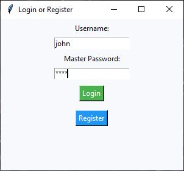
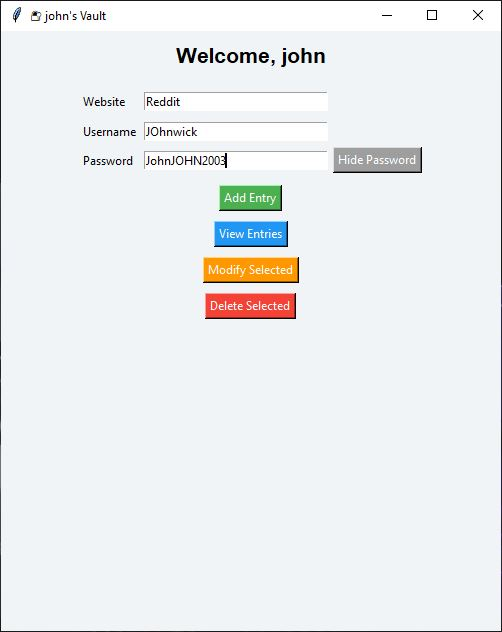
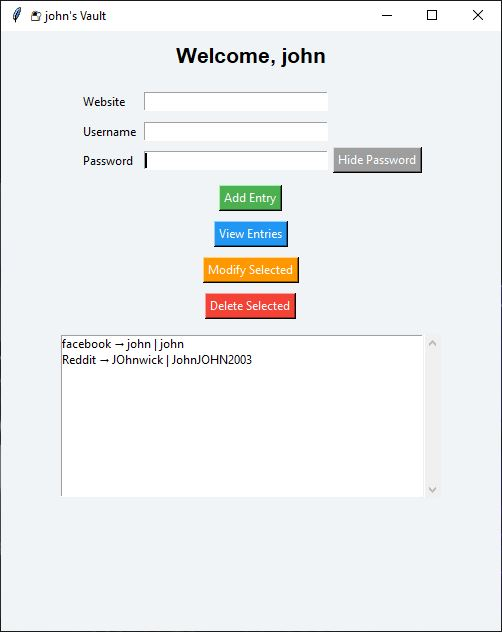

 🔐 Multi-User Encrypted Password Vault (with GUI)

A secure password manager built using Python and Tkinter with per-user encryption. Each user can register, login, and store their own personal credentials, safely encrypted using Fernet.

---

 🚀 Features

* 🔑 **User Registration and Login** (with bcrypt password hashing)
* 🔐 **Per-user encrypted vaults** using Fernet symmetric encryption
* 🖥️ **User-friendly GUI** with Tkinter
* ➕ Add password entries
* 👁️ View all saved entries with "Show Password" toggle
* 📝 Modify or delete selected entries
* 👤 Only the logged-in user can access their vault

---

 📁 Project Structure

```bash
├── vault_app.py            # Main application file
├── users.json              # Stores usernames and hashed passwords (Ignored in Git)
├── key_<username>.key      # Per-user encryption key (Ignored in Git)
├── vault_<username>.json   # Encrypted vault data (Ignored in Git)
├── README.md               # Project documentation
├── .gitignore              # Prevents sensitive files from being committed
```

---

## 🛠️ Setup Instructions

1. **Clone the repository**

```bash
git clone https://github.com/your-username/password-vault.git
cd password-vault
```

2. **Install dependencies**

```bash
pip install cryptography bcrypt
```

3. **Run the application**

```bash
python vault_app.py
```

---

## 🧠 How It Works

* Each user is assigned their own `.key` and `.json` vault.
* The vault is encrypted using Fernet (AES-128 under the hood).
* All passwords are stored encrypted on disk — even if someone gets the file, they can't read it without the key.
* User passwords are hashed using `bcrypt`, never stored in plaintext.

---

## 📸 GUI Screenshots

### 🔐 Login Screen


### 🧾 Vault Dashboard

### 🧾Stored Credntials

---

## ⚠️ Security Notes

Make sure to never upload your personal data. The following files are ignored using `.gitignore`:

```
*.json
*.key
```

---

## 🙋‍♂️ Author

**Khan Affan Masood**
Final Year Computer Engineering Student
GitHub: [@your-github](https://github.com/your-github)

---

## 📃 License

This project is licensed under the MIT License. Feel free to use and improve it!
